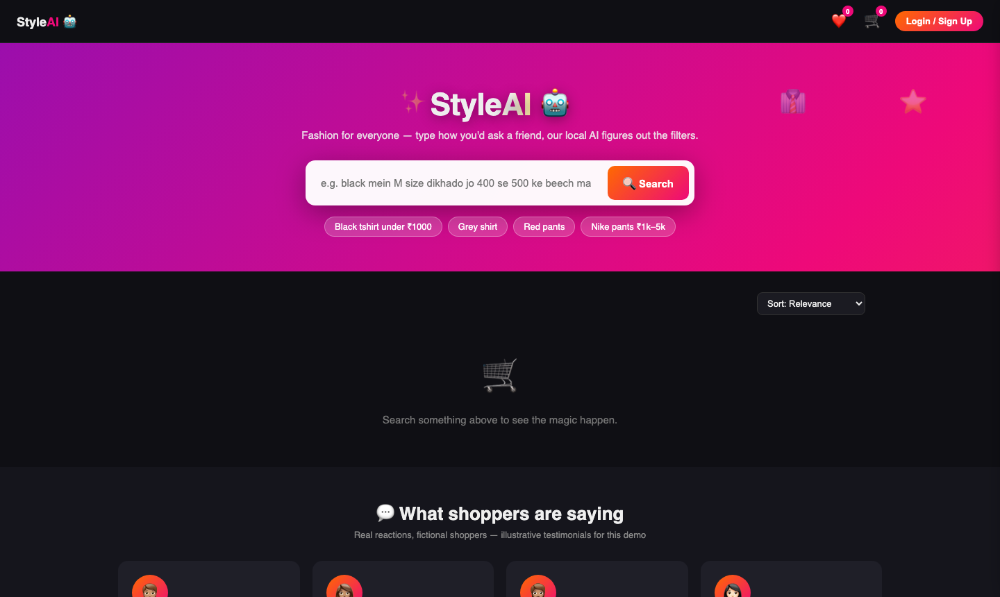
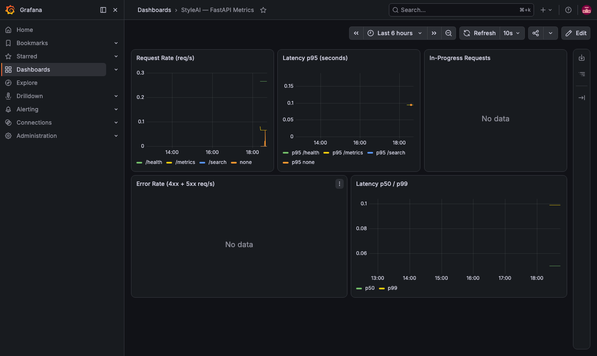
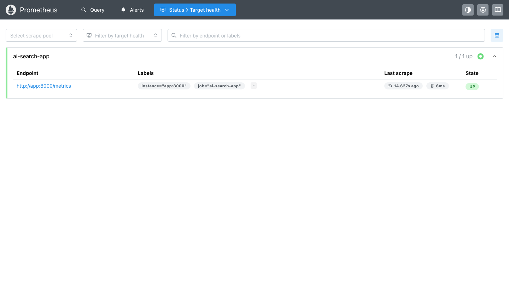
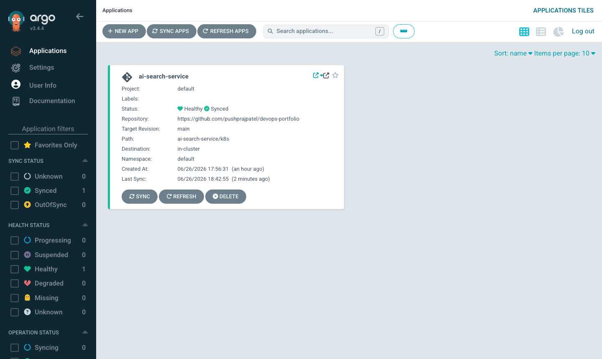

# StyleAI — AI-Powered E-commerce Search

A full-stack e-commerce application where a **locally-hosted LLM** (no external API, zero token cost) parses natural-language product queries — including Hinglish — into structured filters via tool-calling, then queries a live product catalog in real time.

> "black mein M size dikhado jo 400 se 500 ke beech mai ho" → `{color: black, size: M, min_price: 400, max_price: 500}`

Built as an end-to-end DevOps showcase covering containerisation, Kubernetes orchestration, GitOps, observability, alerting, autoscaling, and a fully automated CI/CD pipeline with container image publishing.

---

## Screenshots

| StyleAI App | Grafana — Live Metrics |
|---|---|
|  |  |

| Prometheus — Target UP | ArgoCD — Healthy & Synced |
|---|---|
|  |  |

---

## Features

- **AI-powered natural-language search** — [Ollama](https://ollama.ai) (`qwen2.5:7b`) runs locally; tool-calling extracts structured filters from free-text queries with no external API dependency
- **Full e-commerce UI** — animated storefront, product detail modal, cart, wishlist, sort/filter, and a simulated checkout flow with QR-code payment screen
- **Authentication** — customer signup/login and an admin role; passwords hashed with PBKDF2-HMAC-SHA256 and session tokens generated with `secrets.token_hex`
- **100-product catalog** — real product photography with category, brand, colour, size, and pricing metadata; SQLite-backed
- **Fully containerised** — `docker compose up` starts the entire stack (app, Ollama, Prometheus, Grafana) with zero manual configuration
- **Kubernetes-ready** — Deployment, Service, PVC, and health-probe manifests for every component; validated on Minikube
- **Horizontal Pod Autoscaler** — automatically scales the app between 1 and 5 replicas based on CPU (70%) and memory (80%) utilisation
- **Resource-governed pods** — CPU and memory requests/limits defined on every container to enable reliable scheduling and HPA
- **GitOps via ArgoCD** — any push to `k8s/` on `main` is automatically reconciled to the cluster; no manual `kubectl apply` required
- **Observability** — Prometheus scrapes `/metrics` every 15 s; a custom Grafana dashboard visualises request rate, p50/p95/p99 latency, and error rate per endpoint
- **Alerting** — three Prometheus alerting rules (app down, high error rate, high latency) wired to Alertmanager for notification routing
- **CI/CD pipeline** — GitHub Actions runs lint → test → build → security scan → publish on every push to `main`; images are tagged with `:latest` and `:<git-sha>` and published to GitHub Container Registry (GHCR)

---

## Architecture

```
┌─────────────┐   NL query    ┌──────────────────┐   tool-call    ┌──────────────────┐
│   Browser   │ ────────────▶ │  FastAPI server   │ ─────────────▶ │  Ollama (local)  │
│ (frontend)  │ ◀──────────── │    (main.py)      │ ◀───────────── │  qwen2.5:7b      │
└─────────────┘   JSON resp   └──────────────────┘  structured     └──────────────────┘
                                       │              filters
                                       ▼
                              ┌──────────────────┐
                              │  SQLite           │
                              │  (100 products    │
                              │   + auth)         │
                              └──────────────────┘

Observability
┌────────────────┐  scrape /metrics  ┌──────────────┐  query  ┌─────────────┐
│  FastAPI app   │ ─────────────────▶│  Prometheus  │ ───────▶│   Grafana   │
│  :8000         │    every 15 s     │  :9090       │         │   :3000     │
└────────────────┘                   └──────────────┘         └─────────────┘
                                            │ fire alerts
                                            ▼
                                     ┌──────────────┐
                                     │ Alertmanager │
                                     │  :9093       │
                                     └──────────────┘

GitOps
┌──────────────┐  push to main  ┌──────────────┐  reconcile  ┌─────────────┐
│  GitHub repo │ ──────────────▶│    ArgoCD    │ ───────────▶│  Kubernetes │
│  k8s/        │   auto-sync    │              │             │  cluster    │
└──────────────┘                └──────────────┘             └─────────────┘

CI/CD
  Lint (ruff) → Test (pytest) → Build (Docker) → Scan (Trivy) → Push (GHCR)
```

---

## Tech Stack

| Layer | Tools |
|---|---|
| Backend | Python 3.11, FastAPI, SQLite |
| AI / NL search | Ollama (`qwen2.5:7b`), tool-calling |
| Frontend | Vanilla HTML / CSS / JS (no build step) |
| Containers | Docker, Docker Compose |
| Orchestration | Kubernetes — Deployment, Service, PVC, HPA, Ingress; validated on Minikube |
| GitOps / CD | ArgoCD — auto-syncs `k8s/` on every push to `main` |
| Observability | Prometheus, Grafana, Alertmanager; `/metrics` via `prometheus-fastapi-instrumentator` |
| CI/CD | GitHub Actions — lint → test → build → Trivy scan → push to GHCR |
| Image registry | GitHub Container Registry (GHCR) — tagged `:latest` + `:<git-sha>` |
| Testing | pytest, FastAPI `TestClient` |
| Security | Trivy container scanning (blocks on unfixed HIGH/CRITICAL CVEs), PBKDF2 password hashing |
| IaC | Terraform — AWS ALB + Auto Scaling Group of EC2 instances |

---

## Quick Start — Docker Compose

The fastest way to run the full stack locally:

```bash
cd ai-search-service
docker compose up -d
```

On first run this builds the app image, starts Ollama, pulls the `qwen2.5:7b` model, seeds the database, and launches Prometheus and Grafana. No further configuration is needed.

| Service | URL |
|---|---|
| App | http://localhost:8000 |
| Metrics endpoint | http://localhost:8000/metrics |
| Prometheus | http://localhost:9090 |
| Grafana | http://localhost:3000 — `admin` / `admin` |

---

## Quick Start — Kubernetes / Minikube

The setup script handles everything automatically — Homebrew, Docker Desktop, Minikube, kubectl, ArgoCD, and the full application stack. The only prerequisite is macOS.

```bash
git clone https://github.com/pushprajpatel/devops-portfolio.git
cd devops-portfolio
./local-up.sh
```

The script will:
1. Start Minikube (if not already running)
2. Enable and configure the Nginx Ingress addon
3. Apply all `k8s/` manifests — app, Ollama, Prometheus, Grafana, Alertmanager, HPA, and Ingress
4. Create the ArgoCD ingress in the `argocd` namespace
5. Add entries to `/etc/hosts` (requires `sudo` once)
6. Start `minikube tunnel` to route traffic through `127.0.0.1`

All services are then reachable via local DNS. Keep the terminal open while working:

| Service | URL | Credentials |
|---|---|---|
| App | http://styleai.test | — |
| Prometheus | http://prometheus.test | — |
| Grafana | http://grafana.test | admin / admin |
| ArgoCD | https://argocd.test | admin / see below |

**Retrieve the ArgoCD admin password:**
```bash
kubectl -n argocd get secret argocd-initial-admin-secret \
  -o jsonpath="{.data.password}" | base64 -d
```

> **macOS note:** `.test` domains are used instead of `.local` because macOS routes `.local` through mDNS (Bonjour) and bypasses `/etc/hosts` for those names.

**First-time image load into Minikube** (if pods show `ImagePullBackOff`):
```bash
cd ai-search-service
docker build -t ai-search-service:ci .
docker save ai-search-service:ci -o /tmp/ai-search.tar
minikube cp /tmp/ai-search.tar /tmp/ai-search.tar
minikube ssh "docker load -i /tmp/ai-search.tar"
kubectl rollout restart deployment/app
```

---

## Run Locally Without Docker

```bash
cd ai-search-service
python3 -m venv venv && source venv/bin/activate
pip install -r requirements.txt

ollama pull qwen2.5:7b && ollama serve &
python3 db.py
uvicorn main:app --reload --port 8000
```

Requires [Ollama](https://ollama.ai) installed on the host.

---

## Project Structure

```
ai-search-service/
├── main.py                      # FastAPI app — search, auth, admin, /metrics
├── db.py                        # DB schema, seed data, and image seeding
├── frontend/index.html          # SPA — search, cart, wishlist, checkout
├── prometheus.yml               # Prometheus scrape config for Docker Compose
├── Dockerfile
├── docker-compose.yml           # App + Ollama + Prometheus + Grafana
├── pipeline.sh                  # Local CI/CD runner (stage-by-stage)
├── tests/
│   ├── conftest.py
│   └── test_main.py             # 13 pytest tests (Ollama mocked)
├── k8s/
│   ├── app-deployment.yaml      # Deployment + Service + PVC (with resource limits)
│   ├── ollama-deployment.yaml
│   ├── hpa.yaml                 # HorizontalPodAutoscaler — 1–5 replicas
│   ├── monitoring.yaml          # Prometheus + Grafana + Alertmanager + alert rules
│   ├── ingress.yaml             # Nginx Ingress for .test local DNS
│   └── argocd-app.yaml          # ArgoCD Application (GitOps auto-sync)
├── requirements.txt
└── requirements-dev.txt
```

---

## CI/CD Pipeline

**GitHub Actions** (`.github/workflows/ci.yml`) runs automatically on every push and pull request to `main`:

```
Lint (ruff) → Test (pytest) → Build (Docker) → Scan (Trivy) → Push (GHCR)
```

| Stage | What it does |
|---|---|
| **Lint** | `ruff check` — enforces code style |
| **Test** | `pytest` — 13 tests, Ollama dependency mocked |
| **Build** | `docker build` — produces `ai-search-service:ci` |
| **Scan** | Trivy — fails the pipeline on unfixed HIGH or CRITICAL CVEs |
| **Push** | Publishes to GHCR as `:latest` and `:<git-sha>` (main branch only) |

The image is available at `ghcr.io/pushprajpatel/devops-portfolio`.

The Deploy and Smoke-test stages run locally via `pipeline.sh` rather than in GitHub Actions, because GitHub-hosted runners cannot reach a Minikube cluster. Wiring these into CI would require a self-hosted runner or a cloud cluster as the deployment target.

```bash
cd ai-search-service
./pipeline.sh lint     # ruff
./pipeline.sh test     # pytest
./pipeline.sh build    # docker build
./pipeline.sh scan     # trivy
./pipeline.sh load     # push image into Minikube
./pipeline.sh deploy   # kubectl apply + rollout wait
./pipeline.sh smoke    # curl /health and /search
./pipeline.sh all      # run every stage in sequence
```

---

## Observability

The app exposes Prometheus metrics at `/metrics` via `prometheus-fastapi-instrumentator`, including HTTP request counts, latency histograms, and in-progress request gauges broken down by endpoint.

**Alert rules** (defined in `k8s/monitoring.yaml`) fire when:

| Alert | Condition | Severity |
|---|---|---|
| `AppDown` | Target unreachable for > 1 min | critical |
| `HighErrorRate` | 5xx rate > 5% over 5 min | warning |
| `HighLatencyP95` | p95 latency > 1 s over 2 min | warning |

Alerts are routed through **Alertmanager** (`:9093`), which is pre-configured and ready to forward to any webhook, PagerDuty, Slack, or email receiver.

**Grafana dashboard** (auto-provisioned, titled *StyleAI — FastAPI Metrics*) shows:
- Request rate per endpoint (req/s)
- Latency p50, p95, and p99
- In-progress requests
- Error rate (4xx + 5xx)

---

## GitOps / ArgoCD

`k8s/argocd-app.yaml` registers an ArgoCD `Application` that watches `ai-search-service/k8s/` on the `main` branch and automatically reconciles the cluster state on every push. Any change to a manifest is live in the cluster within seconds — no manual `kubectl apply` is ever needed after the initial setup.

**Install ArgoCD on Minikube:**

```bash
kubectl create namespace argocd
kubectl apply -n argocd --server-side \
  -f https://raw.githubusercontent.com/argoproj/argo-cd/stable/manifests/install.yaml
kubectl wait --for=condition=available deployment --all -n argocd --timeout=300s
```

**Register the application:**

```bash
kubectl apply -f k8s/argocd-app.yaml
```

After this, every `git push` to `k8s/` triggers an automatic sync. The ArgoCD UI (available at `https://argocd.test` when running via `local-up.sh`) shows real-time sync status, health, and deployment history.

---

## Autoscaling

`k8s/hpa.yaml` defines a `HorizontalPodAutoscaler` that watches the app Deployment and scales between **1 and 5 replicas** when:
- CPU utilisation exceeds **70%**, or
- Memory utilisation exceeds **80%**

Requires the `metrics-server` addon: `minikube addons enable metrics-server`

---

## Demo Credentials

| Role | Username | Password |
|---|---|---|
| Admin | `admin` | `admin` |
| Customer | *register via the UI* | — |

Admin credentials are seeded from `ADMIN_USERNAME` / `ADMIN_PASSWORD` environment variables (see `.env.example`). The values above are local-development defaults only — always override them before deploying to any shared environment.

---

## Known Limitations

- **In-memory sessions** — session tokens reset on server restart; not suitable for production
- **Limited catalogue** — 4 colours and 3 categories, constrained by available royalty-free product photography
- **No real payment processing** — the checkout flow is a UI simulation

---

## License

MIT — built as a personal DevOps portfolio project.
